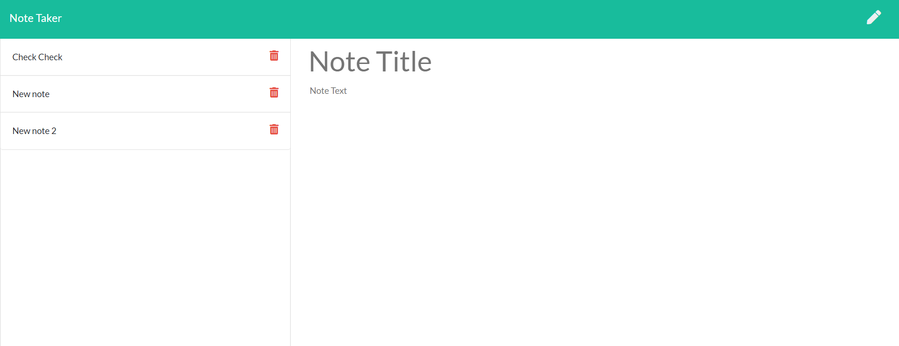

## Notes ##
AS A user, I want to be able to write and save notes
I WANT to be able to delete notes I've written before
SO THAT I can organize my thoughts and keep track of tasks I need to complete

## Use ##
In this application, we have the option of writing a note subject line and a note body. These notes are saved and able to be seen after the page is closed and reloaded. 

## Deployment ## 
This application is deployed using Heroku. 

It is also here: https://westonbmeier.github.io/notes/

## Running it locally ##

-Install the dependencies with npm i; 
-Run: node server.js
-The default port is set at http://localhost:3000

## Screenshot ##

